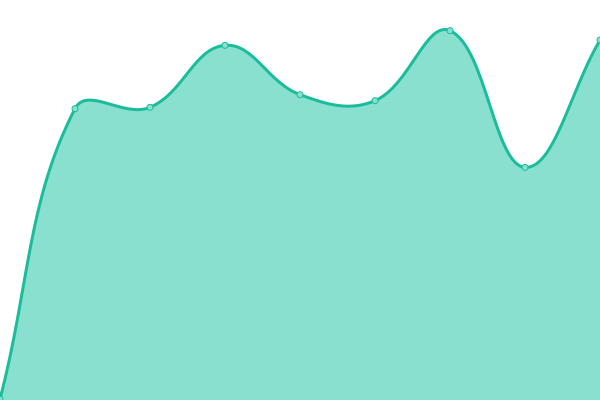

# [📈 Live Status](https://status.windreserve.de): <!--live status--> **Alle Systeme verfügbar**

This repository contains the open-source uptime monitor and status page for [Upptime](https://upptime.js.org), powered by [Upptime](https://github.com/upptime/upptime).

With [Upptime](https://upptime.js.org), you can get your own unlimited and free uptime monitor and status page, powered entirely by a GitHub repository. We use [Issues](https://github.com/upptime/upptime/issues) as incident reports, [Actions](https://github.com/WindReserve/status/actions) as uptime monitors, and [Pages](https://status.windreserve.de) for the status page.

<!--start: status pages-->
<!-- This summary is generated by Upptime (https://github.com/upptime/upptime) -->
<!-- Do not edit this manually, your changes will be overwritten -->
<!-- prettier-ignore -->
| URL | Status | History | Response Time | Uptime |
| --- | ------ | ------- | ------------- | ------ |
|  [WindReserve Website](https:/windreserve.de) | Verfügbar | [wind-reserve-website.yml](https://github.com/WindReserve/status/commits/HEAD/history/wind-reserve-website.yml) | 

 674ms
     
 | 

<a href="https://status.windreserve.de/history/wind-reserve-website">100.00%</a>
    

|  [Cloud](https://cloud.windreserve.de) | Verfügbar | [cloud.yml](https://github.com/WindReserve/status/commits/HEAD/history/cloud.yml) | 

 835ms
     
 | 

<a href="https://status.windreserve.de/history/cloud">100.00%</a>
    

|  [Wiki](https://wiki.windreserve.de) | Verfügbar | [wiki.yml](https://github.com/WindReserve/status/commits/HEAD/history/wiki.yml) | 

 781ms
     
 | 

<a href="https://status.windreserve.de/history/wiki">99.47%</a>
    

|  [Craftnote](https://app.mycraftnote.de) | Verfügbar | [craftnote.yml](https://github.com/WindReserve/status/commits/HEAD/history/craftnote.yml) | 

 245ms
     
 | 

<a href="https://status.windreserve.de/history/craftnote">100.00%</a>
    

|  [Strato Webmail](https://webmail.strato.de/appsuite/signin#!!&app=io.ox/mail&folder=default0/INBOX) | Verfügbar | [strato-webmail.yml](https://github.com/WindReserve/status/commits/HEAD/history/strato-webmail.yml) | 

 476ms
     
 | 

<a href="https://status.windreserve.de/history/strato-webmail">100.00%</a>
    

|  [Element](https://element.windreserve.de) | Verfügbar | [element.yml](https://github.com/WindReserve/status/commits/HEAD/history/element.yml) | 

 384ms
     
 | 

<a href="https://status.windreserve.de/history/element">100.00%</a>
    

|  [Inventory](https://inventory.windreserve.de) | Verfügbar | [inventory.yml](https://github.com/WindReserve/status/commits/HEAD/history/inventory.yml) | 

 790ms
     
 | 

<a href="https://status.windreserve.de/history/inventory">99.49%</a>
    

|  [Grafana](https://grafana.windreserve.de) | Verfügbar | [grafana.yml](https://github.com/WindReserve/status/commits/HEAD/history/grafana.yml) | 

 628ms
     
 | 

<a href="https://status.windreserve.de/history/grafana">99.58%</a>
    

|  [Alertmanager](https://alertmanager.windreserve.de) | Verfügbar | [alertmanager.yml](https://github.com/WindReserve/status/commits/HEAD/history/alertmanager.yml) | 

 476ms
     
 | 

<a href="https://status.windreserve.de/history/alertmanager">99.59%</a>
    

|  [Matomo](https://matomo.windreserve.de) | Verfügbar | [matomo.yml](https://github.com/WindReserve/status/commits/HEAD/history/matomo.yml) | 

 655ms
     
 | 

<a href="https://status.windreserve.de/history/matomo">99.60%</a>
    

|  [Synapse Admin](https://matrix.windreserve.de/synapse-admin) | Verfügbar | [synapse-admin.yml](https://github.com/WindReserve/status/commits/HEAD/history/synapse-admin.yml) | 

 402ms
     
 | 

<a href="https://status.windreserve.de/history/synapse-admin">100.00%</a>
    

<!--end: status pages-->

[**Visit our status website →**](https://status.windreserve.de)

## 📄 License

- Powered by: [Upptime](https://github.com/upptime/upptime)
- Code: [MIT](./LICENSE) © [Upptime](https://upptime.js.org)
- Data in the `./history` directory: [Open Database License](https://opendatacommons.org/licenses/odbl/1-0/)
